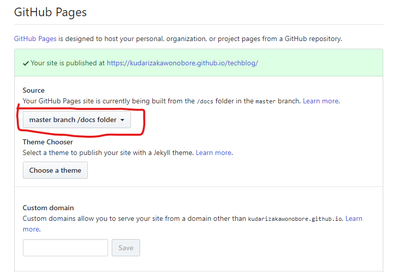

## 動機 
いままで個人ブログの作成を はてなブログでやっていたが、下記のような課題を感じていた

### エディタ・コピペ問題
普段、あらゆるエディタのキーバインドを Vim 仕様にしているせいで、ブログの記述も Vim キーバインドでやりたい。

はてなブログの サイト上のエディタ では 私の知る限り、 Vim キーバインドで記述するのは難しい。
そのため、ローカルで Markdown 形式でファイルを作成し、コピペする方式になるのだが、
そうすると下記のような問題にぶち当たる。

#### キャプチャ管理問題
キャプチャを貼り付けるときは、ブログが管理しているディレクトリのリンクを記述することになる。
ローカルで確認しにくいうえ、アップロードのたびにサイトに行ったり、「ここにキャプチャ」的な記述を残したりするのが面倒。

#### Preview 煩わしい問題
記事を書き終わった後、ローカルで記述した記事を公開用に調整（主に見た目）するときに、何度も Preview → 書き直し を繰り返すことになる。
これが、ページ遷移が何度も発生するため、かなり煩わしいことに加え、上記の問題と相まって、サイト → ローカル へのコピペも必要になったりして、デグレが発生する確率も上がる。

ローカルでサクサクと、公開用の見た目を調整して、ワンコマンドで公開、なんてことを目指したいところ。

実際、はてなブログ用のCSS やらをローカルに落としてきて、疑似的に開発環境を構築することもできるのだろうが、最近は静的サイトジェネレータと、GitHubPages を使えば、簡単に上記課題を解決できるので思い切って移行してみることにした。

## Hugo

静的サイトジェネレータを複数試して比較してみた結果、Hexo と Hugo が候補に残った。  

Hexo は Node ベースの静的サイトジェネレータで、Hugo と引けを取らない機能の充実ぶりと、GithubPages に公開するまでの手順が非常に簡単なのが魅力だったが、LiveReload の速さが決め手で、Hugo を選択することにした。

Hugo とは、静的サイトジェネレータの1種で、 Go によって動く。

## インストール方法

### 前提
下記はインストール済みである前提

- Go
- Git

### インストール手順（簡単）

下記リンクから、exe をダウンロードして、Pathを通すだけでOK

https://github.com/gohugoio/hugo/releases

[公式サイト](https://gohugo.io/getting-started/installing/)には、　Chocolatey を使ってインストールする方法が記述されているので、
お好きな方で。

## 各種 コマンド

### サイトを作成

``` shell
  hugo new site <サイトを管理するディレクトリ名>
```

上記コマンドを実行すると、ディレクトリに必要なファイルが生成される。

### 新しい記事を作成

新しいページを作成するには、下記のコマンドを実行する。

``` shell
   hugo new post/00_hugo.md
```

### ローカルで確認するには

下記コマンドで、 ローカルにサーバーを立ち上げて、 Live Reload で確認できる

``` shell
   hugo server -D
```

反映がかなり早いので、細かな修正も即座に確認できる。

### Hugo のサイト公開方法

Hugo 、というより、Hugo を使って GitHubPages を公開する方法を紹介。

大まかな方針としては、 Hugo のパブリッシュディレクトリ名を `docs` に設定し、
docs ディレクトリを GitHub に Push することで、ブログが自動で公開される
仕組みを設定してしまおう、というもの。

#### GitHub 上でやること

##### リポジトリ に GitHubPages の設定をする
リポジトリ を開いて、 Settings → GitHubPages から、Source を `master branch /docs folder` に設定する



#### ローカルでやること

BaserURL の調整と、 PublishDir の調整をしてやる。

##### BaseURL を公開するリポジトリに設定する

`config.toml` を編集し、BaseURL を実際に公開する GitHubPages のURL に設定する。
私の場合、 GitHub のID が、 `kudarizakawonobore` で、 公開するリポジトリ名が ```techblog``` なので、 BaseURL は下記のように設定する。

```toml:config.toml
  baseURL = "https://kudarizakawonobore.github.io/techblog/"
  canonifyurls = true
```

##### Publish ディレクトリを docs にする
デフォルトでは、Publish ディレクトリは public になるため、これを docs にしてやる。
GitHubPages に公開されるディレクトリ名を public にする方法がわからなかったので、ひとまずビルド側を調整。

```toml:config.toml
  publishDir = "docs"
```

##### リモートリポジトリを GitHub のリポジトリに設定する

下記コマンドで リモートリポジトリを設定する。

```shell
  git init
  git remote add origin <リポジトリURL>
```

##### ドキュメントをビルドする

下記コマンドで docsディレクトリにファイルが展開される

```shell
  hugo
```

この状態で、master ブランチにプッシュしてあげれば、ブログが公開される。
```shell
  git add docs
  git commit -m 'first commit'
  git push -u origin master
```

## 感想
初期設定は多少面倒だが、最初に設定さえしてしまえば あとは記事の追加のみに集中できるのが良い。
