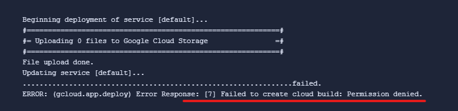
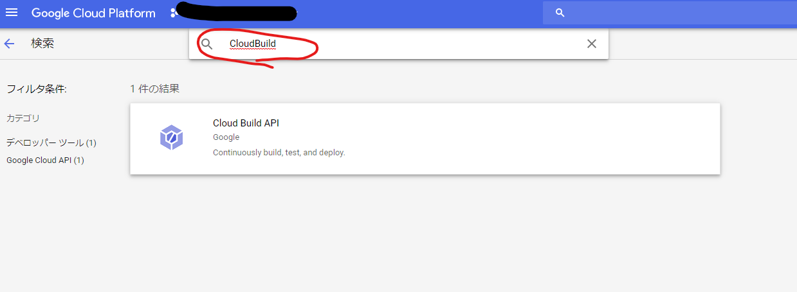
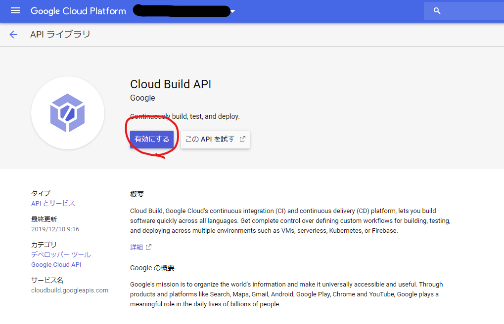

## 概要
自分の勉強用のメモ書きなど、一般公開はしたくないものの、インターネット上から一部の
人に見せたいようなドキュメントは、普段 AppEngine × IdentityAwareProxy で認証付きサイトとして限定公開している。

デプロイを手動でやると面倒なので、BitBucket の BuildPipeline から自動でデプロイするように設定しているのだが、2週間ぐらい前に突然失敗するようになっていた。

## 対象となる人
`gcloud app deploy` コマンド実行時、下記のように、Failed to create cloud build: Permission denied. と表示される人。

## 結論
題名の通り。デプロイに使っている サービスアカウントから、CloudBuild を実行できるようにしてあげたらデプロイできるようになる。

以下、手順。

### API の有効化
プロジェクトで普段 CloudBuild を使っていない場合は、API を有効化してやる。
プロジェクトオーナー権限でデプロイしている人は、この手順だけでOKのはず。

`APIとサービス` から `API の有効化` ボタンを押下して、API を有効化する。

### 当該サービスアカウントに CloudBuild の実行権限を付与する
サービスアカウントをきっちり管理している人は、最低限の権限しか与えていないはずなので、
CloudBuild サービスアカウント ロールを付与してやる必要がある。

`IAM と管理` -> `IAM` から、デプロイに使っているサービスアカウントを選択して、
下記のように、`Cloud Build サービスアカウント` の役割を追加する。

最終的に、下記の権限がついていればOK

- AppEngine 管理者

- Cloud Build サービスアカウント

- ストレージオブジェクト管理者

## 原因
app engine のデプロイ時、内部的に CloudBuild が使われるようになったのだと
予想されるが、ちゃんとした情報ソースは見つかっていない。

Cloud Functions で、Cloud Build を使うから、API 有効にしてねという旨は、ActionRequrired でメール飛んできてるけど、それ関連かな？
