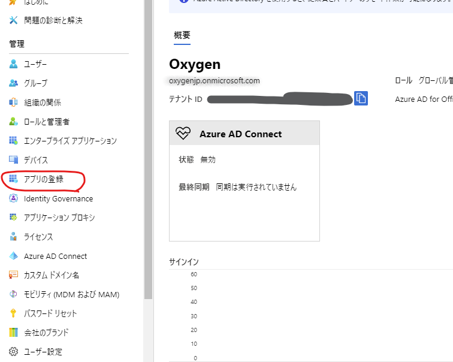
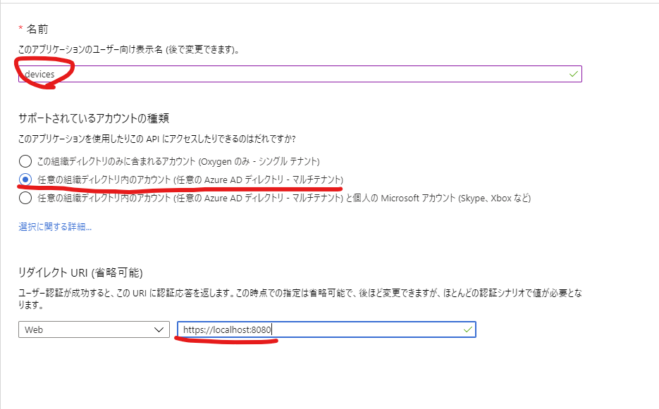
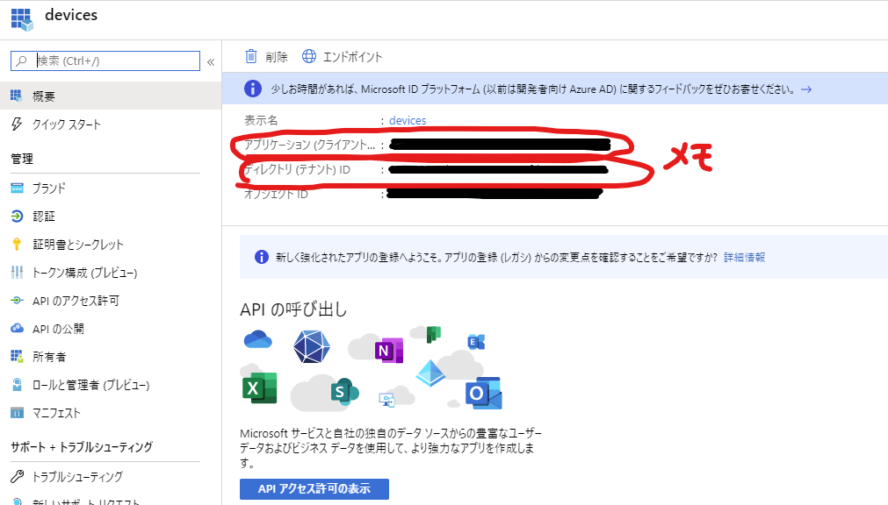
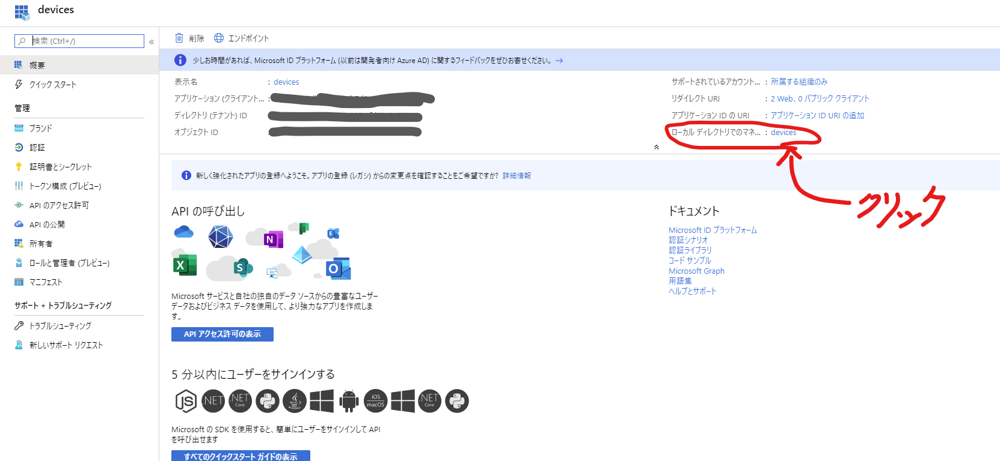
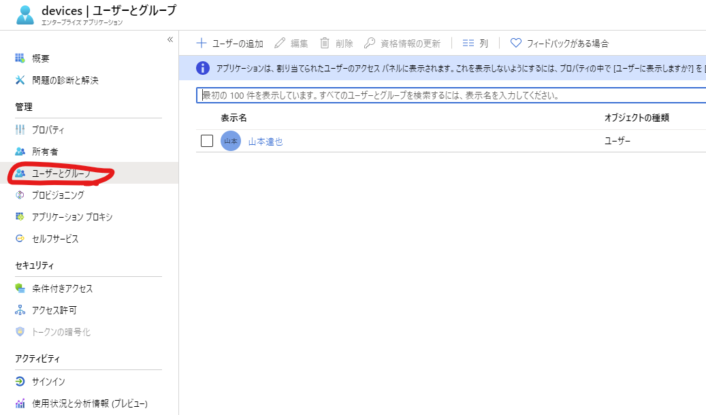
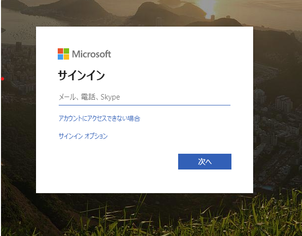

## 動機
クラウド上に、一般公開したくない便利ツールや組織内ツールを配置するときなどは、不特定多数の人間に見られないように、何らかの制限を加えることになる。

業務拠点が1か所に限定される場合は、IPアドレス制限で事足りてしまうこともあるが、リモートワークやら、他企業との連携など、多様な業務に対応するのは難しく、あるタイミングから、認証の基盤が必要になってくる。

簡易的でいいのであれば、basic 認証でもいいのだが、パスワードが乱立すると管理が煩雑になる。クラウド上にアップロードしたコンテンツを、組織内 AD のアカウントで閲覧制限できるようになると、運用も楽になって安心である。

## GCP (Google アカウント）でやる場合
GCP でやる場合は割と簡単で、 App Engine 上にコンテンツを作成し、 Identity Aware Proxy で保護してやれば、管理者がホワイトリストで一覧化した Google アカウント のみに閲覧を許可することができる。

しかし、アカウント管理が AzureAD ベースになっている組織で、非公式に Google アカウントを発行すると、退職/退プロ者 のアカウント削除漏れが発生する可能性が出てきて、インシデントにつながりやすい。(人事部の運用も大変になる)

Azure AD のアカウントを GSuite に統合する方法もあるが、 GSuite の管理者権限が必要だったり、組織全体を巻き込んだ大がかりな意思決定が必要になるっぽい。

そのため、あくまでAzure のリソースや、AD の設定をいじるだけで、MSアカウントで 認証を実現する方法を考えてみたい。

## ゴール
Blob 上にホストした SPA(Vue.js で実装) を、ホワイトリストに登録した AD ユーザー のみが閲覧できるようになれば OK。

この時、ホワイトリストに登録するのは、テナント外の人間も含む。（パートナー企業とか、子会社、親会社への閲覧も想定）

もともと閲覧できていたユーザーを `即時` 閲覧不可にするのは、いったん考えないものとする。

## 準備
やることは、大きく分けて、下記の2つ

- Azure AD のアプリケーションを作成し、ユーザーを割り当てる

- Client アプリを msal で保護する

### Azure AD の アプリケーションの作成
Azure Portal から、 `Azure Active Directory` -> `アプリの登録` と進む。



`新規登録` から、アプリを作成します。



この時、

- アプリの名前は任意

- サポートされているユーザーの種類は、「任意の組織ディレクトリ内アカウント」にする。こうしておくことで、このテナントに所属していないユーザー（ゲストユーザー等）もサインインの対象にできる。

- リダイレクト URI は、アプリをホストするドメイン（ローカルでホストするときは、 `http://localhost:8080` , Blob 上にホストするときは、 `https://<storage account name>.blob.windows.net/<container name>/index.html#/` 等。) リダイレクト URL は後から複数に変更できるので、ひとまず localhost で。



アプリが作成できたら、作成したアプリを選択し、アプリケーション ID とテナントID をメモしておく。後でクライアント側を実装するときに使うことになる。

#### アプリに ユーザーを割り当てる
ユーザーを割り当てない状態だと、 Azure AD にログインできるユーザーは、誰でもアプリの認証が通ってしまう状態になっている。
着実に進めて行きたいタイプの人は、ここで、ものは試しに、とログインをしてみたくなるが、要注意。後で切り分けが難しくなるので、じっとこらえた方がいい。

アプリを選択した状態の画面で、下図の場所にあるリンクをクリックすると、エンタープライズアプリケーションの設定画面に遷移するので、そこでユーザーの割り当てを行う。



画面左の「ユーザーとグループ」からユーザー、もしくはグループを割り当てる。



これでクラウド側の準備は完了。

### Client アプリ（Vue）で msal を設定する
Node 周りで AD 認証のライブラリを調べていくと、 msal と adal という二種類のライブラリが出てくる。

で、[こちら](https://docs.microsoft.com/ja-jp/azure/active-directory/develop/msal-overview) の記事によると、どうやら msal の方が後継のようなので、特別理由がなければ msal を使った方がよさそうである。

vue で msal を使うためのライブラリを調べていくと、 [vue-msal](https://github.com/mvertopoulos/vue-msal) というライブラリがあった。簡単に認証が実現できるようなので、使ってみる。

#### インストール
npm で簡単にインストール

```
  npm install vue-msal
```

#### 設定
main.js で、下記の通り設定してやる。
公式ドキュメントをよく読まないとわかりづらいが、最低限、
clientId, tenantId, redirectUri の3つは明示的に指定してやる必要がある。
(clientID, tenantId は、アプリケーションの作成時にメモした値)

```javascript:main.js
import msal from 'vue-msal'

Vue.use(msal, {
    auth: {
        clientId: '<アプリのクライアントID>',
        tenantId: '<アプリのテナントID>',
        redirectUri: `${process.env.VUE_APP_API_URL}` // .env.local ファイルで環境変数に設定しておくと、本番用のURL と使い分けやすい
    }
})

```

#### 実装
この方式で、ちゃんとリソースが保護できているかは、セキュリティのレベルに応じてちゃんと考えないといけないが、
ひとまず、App.vue にこんな感じに設定しておけば、認証を強制することができる。

```html:App.vue
<template>
  <div id="app" v-if="$msal.isAuthenticated()">
    <!-- router-view とか -->
  </div>
</template>

<script>
    export default {
        beforeCreate() {
            if (!this.$msal.isAuthenticated()){
                this.$msal.signIn();
            }
        }
    }
</script>
```

#### 動作確認
長かったが、これで準備完了。 ローカルでアプリを立ち上げて、 localhost:8080 にアクセスしたときに、Azure AD のログイン画面に飛ばされる。



この時、アプリケーションに割り当てたユーザーアカウントでログインすれば、画面が表示されるはず。

#### デプロイ
Blob でホストするときは、ビルド前に下記のことに気を付けること。

- `vue.config.js` で publicPath を、デプロイするコンテナ名と一致させること。

- router の mode を history ではなく、 hash にすること。

- 上記に伴い、.env.production で、 RedirectUri の変数を、hash mode 用の URL にすること。

## 感想
Azure AD のユーザーは、使っている組織が多いので、自社、他社で不特定多数の人間とコラボレーションするときは非常に便利そう。

一方で、マネージドサービスのみで完結しない（vue-msal の実装や設定が必要）ので、セキュリティに対する心理的ハードルは高め。
特に、vue の実装周りのところは、扱う情報次第では大いに不安が残るので、プロダクションで同様のことをするのはあまりお勧めしない。

一方で、Blob 上の簡易的なホスティング は、勉強会やモックアップなどで、SSL が必須な環境がほしいときに割とよく使うので、この辺りを完全マネージドで保護する機構とかあるとうれしいのだが。。。

## 感想その2
上記、調査、環境準備、実験条件の整理等々で、かなりの時間と覚悟を要したが、ブログを書き終わった後になって、Azure Learn なる MS公式のコースでわかりやすく紹介されていることが判明。1時間でできるらしい。

https://docs.microsoft.com/ja-jp/learn/modules/secure-app-with-oidc-and-azure-ad/

~~こんなわかりやすいコースがあるなら、Google検索で引っかかりやすくしておいてほしかった。。。~~

とはいえ、諸々試行錯誤した部分も含めて勉強になったのでよしとする。