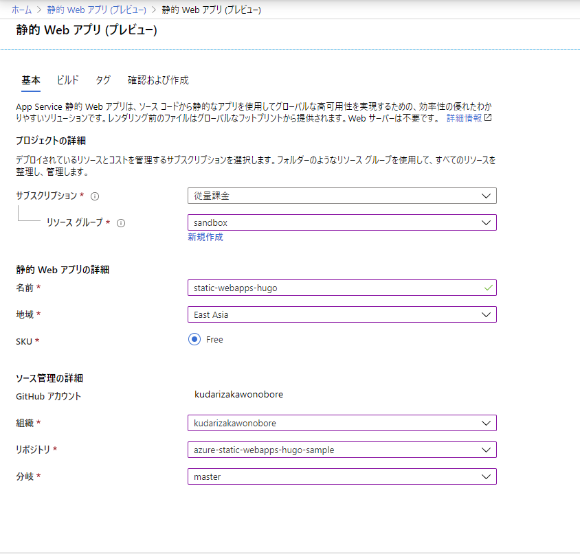
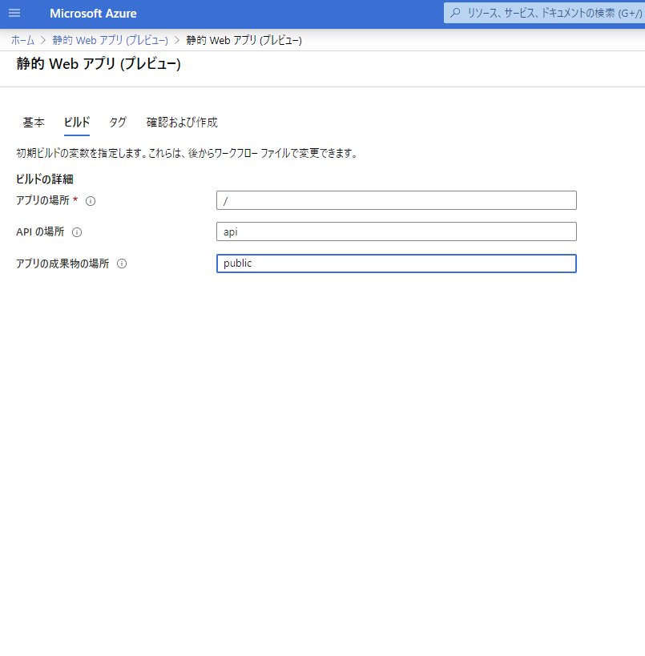
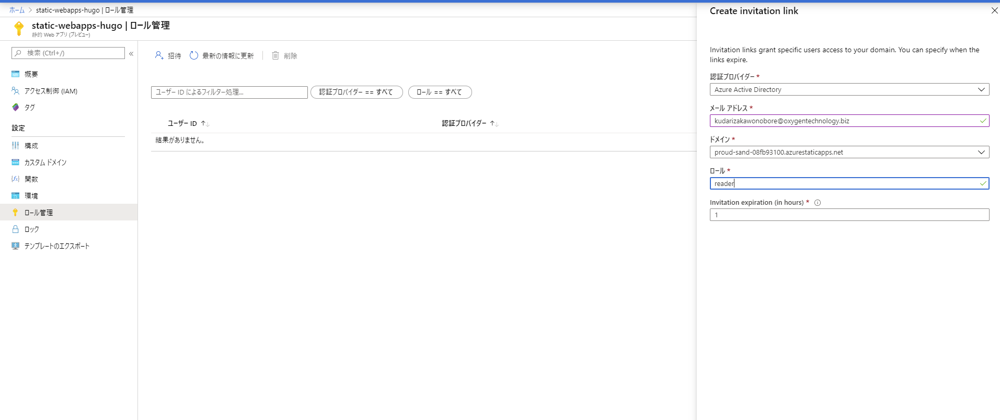
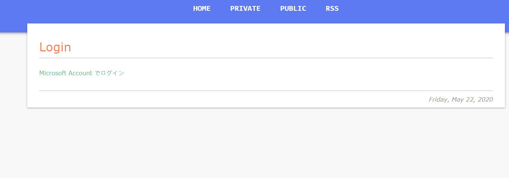
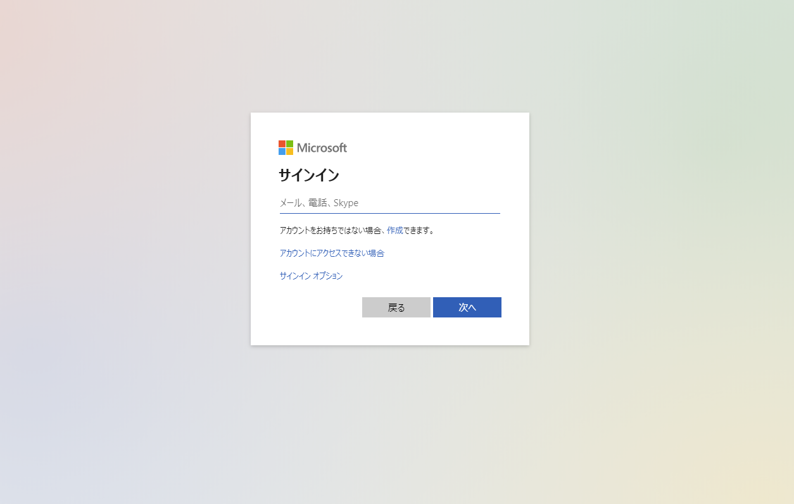
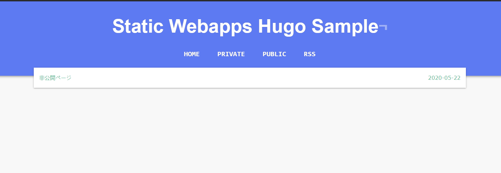
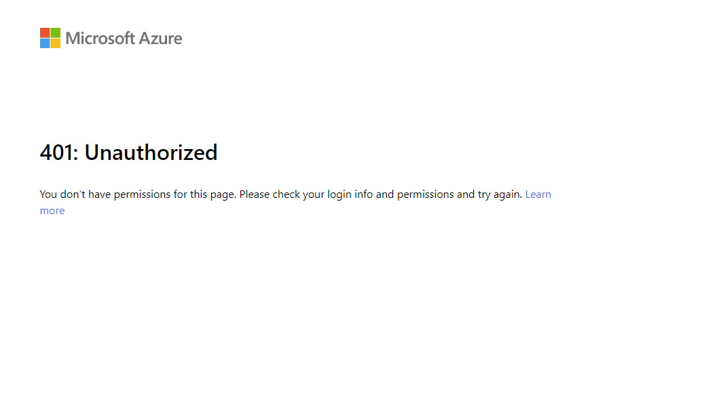

## 概要
[以前]() のブログで、Azure でフルマネージドの認証基盤を使ってサイトのホスティングはできないような話を書いたが、新たに [Static Webapps](https://azure.microsoft.com/ja-jp/services/app-service/static/#overview) なるサービスの Preview が発表され、めでたく要件が実現できるようになった。

しかも、Google AppEngine × IAP では面倒だった、ロールベースで URL 毎に閲覧制限をかけることも手軽にできそうなので、早速試してみた。

## やりたいこと
1. Hugo の静的サイトをホスティング
1. ホスティングしたサイトに Azure AD 認証ベースで、特定のユーザーしか閲覧できないページを作る

## やるべきこと概要
これらを実現するためには、下記のようなことをすればよい。

1. GitHub のリポジトリ上に、Hugo(静的サイト) のプロジェクトを作成
1. Azure Portal から Static Webapps を作成。上記 リポジトリとつなげる
1. Azure Portal 上から、閲覧可能なユーザーを招待
1. Hugo にログイン画面を実装
1. Hugo の アーティファクトディレクトリに、routes.json を配置

## GitHub のリポジトリ上に Hugo プロジェクトを作成
ローカルで Hugo のサイトを新しく作り、 `hugo` コマンドでサイト を生成する。
デフォルトの設定では、 プロジェクトルート直下の public ディレクトリにファイルが生成されるので、それを リポジトリに Push しておく。

## Azure Portal から Static Webapps を作成。リポジトリと連携する
Azure Portal から、 Static Webapps を選択し、新規作成。
上で作った GitHub のリポジトリの設定を書き込む。



### アプリの成果物の場所を public にする
アプリの成果物の場所、は 静的サイトが生成されるディレクトリのことを指すので、`public` にする。  
この時、 public の頭に / を入れると、プロジェクトではなく、ビルド環境のルートディレクトリを参照しようとして、エラーになるので注意。



もしも / を入れてしまったり、アーティファクトディレクトリを変更したい場合は、ポータルからは変更できない。  
変更したい場合は、リポジトリの中の `.github/workflow/azure-static-web-apps-<サイトURL>.json` に記載されている、app_artifact_location の値を修正してやる。

## Azure Portal 上から、閲覧可能なユーザーを招待。
サイトのビルドが完了したら、「ロール管理」からユーザーを招待する。



ここで、「ロール」の個所には、任意のロール名を入れることができる。
今回は、`reader` とした。このロール名は、後ほど、routes.json に書き込むことになるので、覚えておくこと。

## Hugo にログイン画面を実装
ログイン画面、といっても、aタグのみの質素なHTML を、特定のURL に配置するだけ。
content/login/index.html を生成し、下記のように記述する。

```html
<a href="/.auth/login/aad">Microsoft Account でログイン</a>
```

記述したら、`hugo` コマンドで、再度、ページを生成しておく。

## Hugo のアーティファクトディレクトリに、 routes.json を配置する
続いて、Hugo の public ディレクトリの直下に、routes.json を作成し、下記のように記述する。


``` json
{
    "routes": [
        {
            "route": "/login",
            "serve": "/.auth/login/aad"
        },
        {
            "route": "/private/*",
            "allowedRoles": ["reader"]
        }
    ],
    "platformErrorOverrides": [
        {
            "errorType": "Unauthenticated",
            "serve": "/login"
        }
    ]
}
```

### JSON の中身の解説
以下の部分は、Azure AD のログイン用設定。
Twitter や Github のアカウントでログインさせたい場合は、`aad` の部分を、[こちら](https://docs.microsoft.com/ja-jp/azure/static-web-apps/authentication-authorization#login) を参照して、適宜変更/追記/または、連携するサービスをふさいだりする。

``` json
    {
        "route": "/login",
        "serve": "/.auth/login/aad"
    }
```

下記の部分は、/private/ 以下のリソースを参照する場合は、`reader` ロールが必要であることを示している。このロールは、自分で任意に設定できる。

```json
    {
        "route": "/private/*",
        "allowedRoles": ["reader"]
    }
```

下記の部分は、認証が通っていない場合は、login画面に飛ばす設定。
401（unauthorized） だった場合は、signup 用の画面に飛ばす設定も追加してやると親切かもしれない。
```json
    {
        "errorType": "Unauthenticated",
        "serve": "/login"
    }
```

このように設定すると、 https:///サイトドメイン/private にアクセスした際、ユーザーはログイン画面に飛ばされる。認証済み、かつ許可されたロールであれば、閲覧でき、そうでない場合は、authエラーになる。

これらの設定をしたら、再度 public ディレクトリを push してやる。

## 確認
* private のリソースを閲覧すると、ログイン画面に飛ばされる。



* リンクをクリックすると AzureAD の認証画面に飛ぶ



* 許可されたロールのユーザーは、閲覧できる



* 許可されていないユーザーでログインすると、Unauthorized になる



## 総評
非常にシンプルに認証が実現できるのが素晴らしい！
AppEngine × IAP に比べても、作るべきリソースが少なく済む上、json の設定も非常にシンプルで、管理しやすい。
また、URL 単位で、ロールベースのアクセス制御が行えるのも魅力である。しかも安い。

まだ実装していないが、裏側でFunctions も動かせるみたいなので、ちょっと動的な動きも実現できるかもしれない。

一方、Preview 版ゆえなのか、筆者の調査不足かはわからないが、5/22 現在、下記のことはできなさそう。

* GitHub 以外のリポジトリとの連携(Gitlab は実現してほしいな)
* リポジトリを利用しないホスティング（どうしてもリポジトリ上にあげたくないものとか）
* 一つのロールに複数のユーザーを一括で割り当てること(ADグループ単位で割り当てられると嬉しい)
* 一度設定した リポジトリの向き先を変更する(必要かどうかはおいといて)

GA 版の発表が非常に楽しみなサービスである。