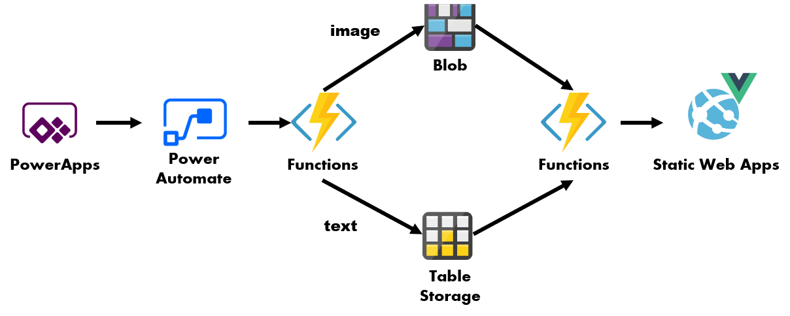
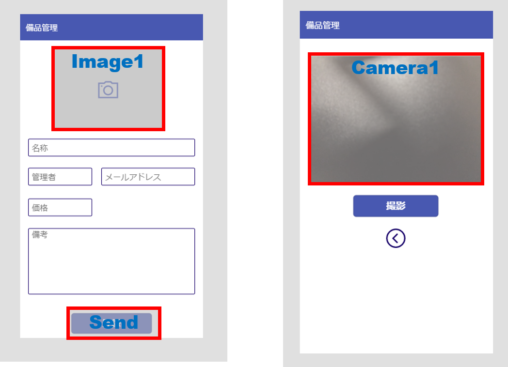
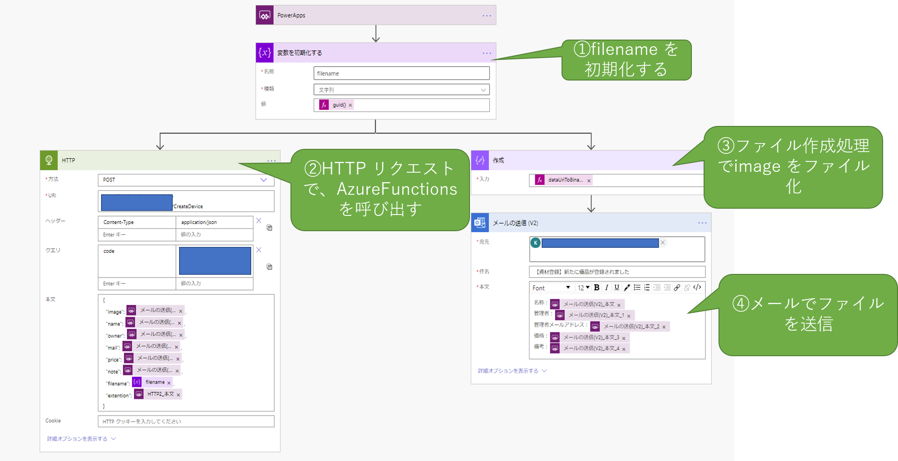
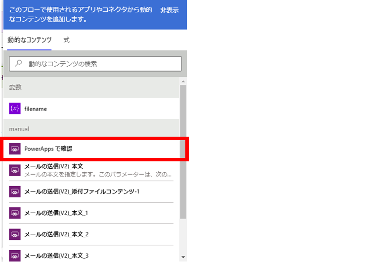
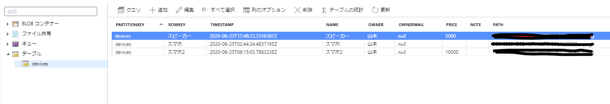
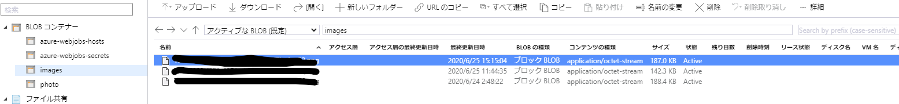
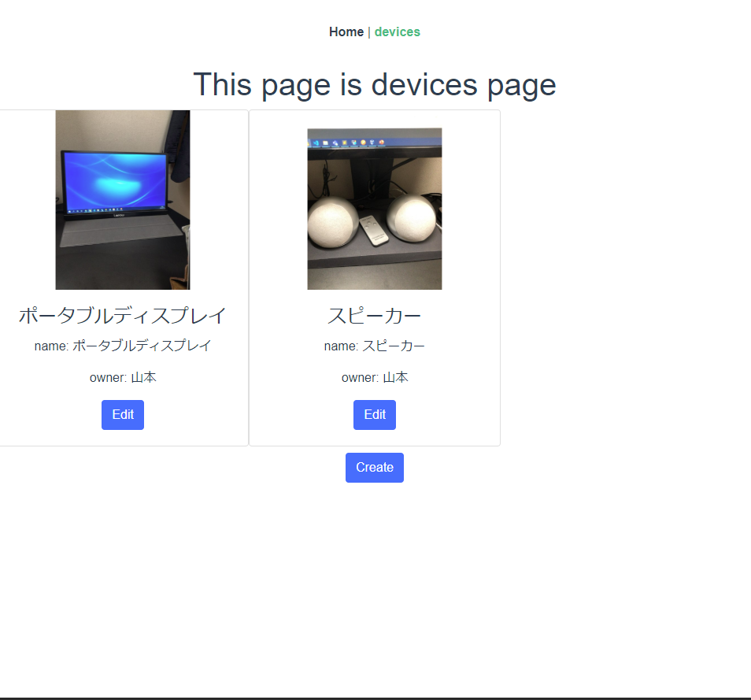

## 動機
PowerPlatform を使わず、 Azure だけ使うのはもったいない、といったお話が、先日聴講したリモートカンファレンスで（もっと強めの言葉で）なされていた。

Azure はともかく、PowerPlatform の方は、個人の勉強レベルで触った程度のレベル感だが、どんなものでも最初は簡単なものから作っていくものだと思うので、ひとまず個人用のアプリケーションを、PowerPlatform × Azure の構成で作ってみることにした。

## 作ってみるもの
個人事業主や、少人数の組織で使う用の、資産管理アプリを作ってみる。

PowerApps を使えば、実は登録処理だけでなく、CRUD 処理全般を完結させることもできるのだが、あくまで主題は Azure と組み合わせることだったりするで、今回は CRUD のうち C（Create）のみを PowerApps に任せ、他は Azure 側でやってみる構成を想定する。



## やること概要
ざっくりこんな感じ

### Azure 側
* Table Storage の作成
* Blob Storage の作成
* Azure Functions の作成
  * 登録用関数の作成
  * 参照用関数の作成

### Office365 側
* PowerApps のアプリ作成
  * 画面の作成
  * PowerAutomate とのつなぎこみ
* PowerAutomate ワークフロー作成
  * ワークフロー作成
  * Azure Functions の呼び出し

---

## Azure リソースの作成
Azure ポータル上で作成する手順を説明していくと、紙面の幅を取るので、AzureCLI の実行例を記載しておく。
Azure Cli のインストールされた環境で下記のような Bash スクリプト(仮に、create.sh とする)を作成し、コマンドを実行する。
正常に実行されると、Table Storage, Blob Storage(Blob 専用アクセス),　Azure Function（App） が出来上がるはず。

```shell
#!/bin/bash

# Usage: 引数に何も指定しなければ、create_ から始まるすべての関数が実行されます
#        引数に関数名を指定すれば、定義されている関数が実行されます。
# EX: bash create.sh create_resource_group

RESOURCE_GROUP="<任意のリソースグループ名>"
STORAGE_ACCOUNT="<任意のストレージアカウント名>"
FUNCTION_APP_NAME="<任意の Function App 名>"
TABLE_NAME="devices"
BLOB_CONTAINER_NAME="images"

create_resource_group() {
  az group create \
    -l "Japan East" \
    -n $RESOURCE_GROUP
}

create_storage_account() {
  az storage account create \
    -n $STORAGE_ACCOUNT \
    -g $RESOURCE_GROUP
}

_get_storage_account_key(){
  az storage account keys list \
    -g $RESOURCE_GROUP \
    --account-name $STORAGE_ACCOUNT \
    --query "[0].value" | tr -d '"'   
}                                     

create_table_storage() {
  az storage table create \
    -n $TABLE_NAME \
    --account-name $STORAGE_ACCOUNT \
    --account-key $(_get_storage_account_key)
}

create_blob_container() {
  az storage container create \
    -n $BLOB_CONTAINER_NAME \
    --account-name $STORAGE_ACCOUNT \
    --account-key $(_get_storage_account_key) \
    --public-access blob
}

create_functionapp() {
  az functionapp create \
    -n $FUNCTION_APP_NAME \
    -g $RESOURCE_GROUP \
    -s $STORAGE_ACCOUNT \
    --functions-version 3 \
    --consumption-plan-location "japaneast"
}

# 削除するときは、 bash スクリプト名 delete で、リソースグループをすべて削除
delete() {
  az group delete \
    -n $RESOURCE_GROUP
}

main() {
  if [ $# -eq 0 ];then
    create_resource_group
    create_storage_account
    create_table_storage
    create_blob_container
    create_functionapp
  else
    local cmd
    for cmd in $@;do
      $cmd
    done
  fi
}

```

### Functions のデプロイ
Azure Functions(Node) で、Table Storage/Blob への Insert 処理と、 Read 処理を実装する。
実際に書いたコードは [こちら](https://github.com/kudarizakawonobore/static-webapps-object-manager/tree/master/api)

#### Insert 処理のポイント
Insert 処理では、下記2つを実装する

* base64 文字列のデコードと、Blobへの保存、
* アプリから上がってくる各種情報を Table Storage へ保存

重要なのは、function.json の記述する下記の、path 部分。
```json
    {
      "name": "blobBinding",
      "type": "blob",
      "path": "images/{filename}.{extention}",
      "connection": "DeviceStorageConnection",
      "direction": "out"
    }
```

blob の 出力バインディングは、(Node の場合) 関数内でファイルパスを変更することができないので、外部から与えてやる必要がある。  
後で、PowerAutomate の解説をするときに出てくる、Guid を `filename` とし、拡張子を `extention` として リクエストに渡してあげることで、リクエストごとにファイルパスが変わるようにしている。

## Power Apps アプリの作成
下準備が長かったが、ここからが本題。  

### 画面構成
スマホアプリで、下記のような二つの画面を作成する。


各部品の名称は下記の通り。



### カメラアイコンを押したときの挙動
カメラアイコン の OnSelect を下記のようにする。（2行に分けているが、実際はセミコロン区切りで1行）

```
Set(stream, 0);
Navigate(Screen2,Fade)
```

1行目は、 stream変数を初期化している。
2行目は、 写真撮影用の 画面（Screen2）に遷移する処理を表している。

### 撮影時の挙動
Camera1 の属性を下記のように設定する

* Camera 属性に、先ほど初期化した、 stream をセットする
* StreamRate 属性は、100 にしておく

撮影用のボタンは OnSelect を下記のようにする。

```
Set(MyCapture, Camera1.Stream);
Navigate(Screen1, Fade)
```

1行目の部分で、変数 MyCapture にカメラの画像が保存される。

### 撮影した画像の表示
Image1 の Image 属性に、先ほど定義した MyCapture をセットしてやると、撮影した画像を確認できる。

この時、カメラアイコンの Visible 属性を下記のようにしておくと、アイコンが非表示になる。

```
If(Len(MyCapture) > 0, false, true)
```

### 撮影した画像の送信
Send ボタンの Onselect に アクション ⇒ Power Automate で PowerAutomate のフローを割り当てる。

PowerAutomate の作成は次の章で説明するが、ひとまず関数引数は下記のようにする。

```
PowerAppsボタン.Run(MyCapture, Match(MyCapture,"^data:image/(?<extention>.*);").extention, Name.Text, OwnerName.Text, OwnerMail.Text, Price.Text, Note.Text)
```

各引数は、それぞれ、画像、画像の拡張子、各種フォームのテキストを示している。

第二引数の Match 関数は、 MyCapture （base64 文字列）から正規表現で メディアタイプを引っこ抜いている。
ファイルを保存する際に後々拡張子が必要になるのだが、PowerAutomate 上で引っこ抜くのが難しそうだったため、（引数が増えるが）ここで引数として渡している。


## PowerAutomate の作成
上記 PowerApps から呼び出すフローを作成する。
フローの全体像は下記の通り



### filename の初期化
「変数」のジョブを選択し、 filename 変数を定義する。
このfilename は、Blob に画像を保存するときのファイル名、および、 table storage に保存するときの Rowkey になるので、 値は guid にする。

### Azure Functions の呼び出し
ホストした Azure Functions を呼び出してあげる。
クエリの code に、Functions の キー を渡してあげることで、PowerAutomate から Functions を呼び出せる。

Json に渡す引数は、「PoweApps で確認」 を選択してあげることで、PowerApps から渡ってきた変数を参照することができる。



なお、ここで定義した変数の名前は変えられない模様。また、定義した順番に依存して、PowerApps 側の引数の順序も変わるので、押す順番は慎重に考えた方がいい。

### ファイルの作成
登録処理を確認するために、並行してメールを送ってあげる。
ファイル作成 ジョブを選択し、dataUriToData 関数で、 base64 文字列をファイルに変換してやることで、メールに添付できるようになる。

### メールの送信
テンプレート本文を記述して、登録結果をメールにして送信する。

送信した結果は下記のような形で送られてくる。


## 結果確認
PowerApps を起動し、写真を撮影して送信すると、 Blob/Table 双方にレコードが追加される。




あとは、読み取り用の API と連携した静的サイトで、ストレージを読み取るなり、別のPowerApps アプリで Table Storage を参照してやれば、備品の管理ができるようになる。

## StaticWebapps で結果を表示
Static Webapps に Vue のアプリケーションをホスティングして、バックエンドとして、先ほど作った Functions を使ってあげると、下記のように、保存した画像を使って管理画面を作ることもできる。（[コード例](https://github.com/kudarizakawonobore/static-webapps-object-manager)）



Functions の保護は、 Functions の proxy と CORS を使って、外部からはアクセスさせないようにできる。

Static Webapps で用意されている Functions を使う方法も考えたが、少し調べた感じでは、当該 Functions には 現時点で リソースへの 接続文字列が設定できないようだったので、断念。


## 捕捉
### PowerApps から直接 Table Storage を参照させることも可能
PowerApps / PowerAutomate が操作できるデータソースは、通常の DB から、OneDrive 上に配置した Excelファイル（これが地味にすごい）まで幅広く取れるので、ただデータに格納するだけであれば、 Functions を間に挟まず、直接つないでしまった方が何かと便利である。

一方、業務の要件によって、意見の分かれるところだと思うのだが、Azure と Office365 のリソースを疎結合にしておくことで、変更を加える際の制約を、Azure 側で吸収しやすくすることができる。

例えば、テーブルのスキーマを変更したり、格納先のTable を変更するよう場合、直接つないでしまうと、Azure 側のリソースの変更に伴い、Office365 側にも都度都度、それなりに複雑な手順の変更を要求することになる。  
しかし、Functions を間にはさんでおくことで、カラム名の変更や、Storage の認証キーの変更といった要件であれば Functions のみで完結できるし、カラムを増やすような要件も、HTTP 要求で投げる Json のスキーマのみを Azure の担当者から、Office365 の管理担当者に連携してあげるだけで変更が可能になる。  
こうすることで、余計なコミュニケーションコストをかけずに変更を行える。（はず）

冒頭で書いた通り、個人向けのアプリなので、ここまで考える必要はないのだが、それぞれ管理担当者や、管理業務を委託する先が異なるような組織の場合は有効かもしれない。

## 感想

### 簡易的な要件にも対応できるのが良い
こんな感じのウェブアプリ、スマホアプリを、Azure Only の構成や、ゼロベースでアプリを作り始めるような構成にした場合、なんだかんだでコスト過多になってしまい、実現しない可能性が高い。

製造にかかるコスト自体は（慣れてしまえば）PowerApps も ネイティブで作るのもあまり変わらないのかもしれないが、アプリのリリースや、配信といった作業は割と知識や組織の統制が必要だったり、セキュリティの考慮など、専門的かつ、幅広い知識を必要としてくる。そのためどうしても「手動でやった方がラク」という結論に陥りやすい。

こういった、「エンジニアに頼むほどでもないけれど、あったら便利」、というアプリの要件は割といろんな組織に内在しているのだが、現実にはエンジニアに相談される前にひっこめられてしまう。このような要件をエンジニア以外の人たちのアイディアと、エンジニアのちょっとした協力のみで解決できるようになると、双方解決できる課題の幅が広がり、ハッピーになれるはずである。ぜひとも流行ってほしい。


## 参考サイト
https://qiita.com/TsuyoshiUshio@github/items/7e10cc19170fad9dc6d9

https://www.3si.co.jp/2019/03/28/powerapps_camera/
