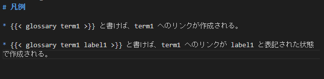
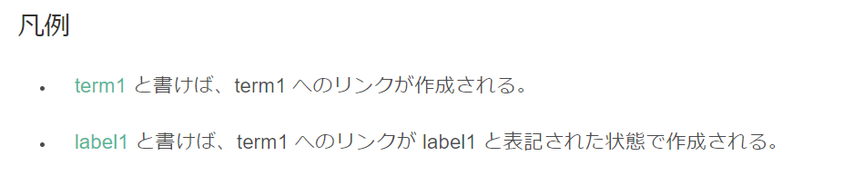

## やりたいこと
[Sphinx の Glossary](https://www.sphinx-doc.org/ja/master/usage/restructuredtext/directives.html?highlight=glossary#directive-glossary) みたいな、特定の用語に対するリンクを Hugo で書いた記事から参照させたい。

## 動機
最近、 [Hugo](https://gohugo.io/) をブログ用途の他に、プロジェクト管理や、ミーティングの議事録に使い始めている。
以前までは、 [Shpinx](https://www.sphinx-doc.org/ja/master/) をメインに使っていて、今でもプログラムの仕様書レベルのきっちりした文章を書くときは Sphinx にお世話になるのだが、いかんせん、 Sphinx は文章量が増えてくると、[auto-build](https://pypi.org/project/sphinx-autobuild/) では反映が遅く、インタラクティブなコミュニケーション、とりわけリモート会議ではいまいちな動きになってしまう。

そのため、文章の修正から反映までの時間が短い Hugo で、Sphinx の便利機能を簡易的に実装して、かゆいところに手が届くようにしたい。

## 利用する機能
* Hugo の [Custom ShortCode](https://gohugo.io/templates/shortcode-templates/) 
* Chrome の [
scroll-to-text-fragment](https://github.com/WICG/scroll-to-text-fragment)(Chrome限定)

## 完成イメージ
* Hugo の文章中に、下記のショートコードを記述してあげると、用語集の特定の term1 アンカーにリンクを貼ってくれる。

```
{{ glossary term1 }}
```

* 下記のように記述してあげれば、用語集の term1 アンカーにリンクを貼り、かつ、元ページの表記は label1 となる。

```
{{ glossary term1 label1 }}
```

(Markdown 表記)

(HTML 表示)


## やること

### 用語集の作成
content 下であれば、どのような形式でも構わないのだが、ひとまず `/content/glossary/index.md` に用語集を作成する。

``` md

# Glossary
## term1 
term1 は、何かしらの用語を表します。

```

### ShortCode の作成
`/layouts/shortcodes/glossary.html` を作成し、下記のように記述します。


{{ $glossary_url := ref . "/content/glossary/index.md" }}
{{ $term := .Get 0 }}
{{ $label := .Get 1 | default $term }}
{{ $link_url := print $glossary_url "#" $term ":~:text=" $term }}
<a href="{{ $link_url }}">{{ $label }}</a>


* 1 行目 は、先ほど作成した `/content/glossary/index.md` の URL を取得している
* 2 ~ 3 行目は、それぞれ位置パラメータ（引数）を取得している
* 4 行目で、link URL に glossary に記述したアンカーと、scroll-to-fragment の記述を追加している

上記のショートコードを作成すれば、記事内で `glossary` ショートコードが利用できるようになる。

## 妥協ポイント
Sphinx の glossary 機能とは、下記の挙動が異なるが、今のところは妥協している。

### 包含関係にある用語は、fragment が優先されてしまう
scroll-to-fragment の機能の影響で、ページ内で最初にヒットした単語がハイライトされてしまう。
そのため、例えば「プロジェクトマネジメント」と「プロジェクト」 の両方をこの順序で glossary に記述して、「プロジェクト」のリンクを作成すると、「プロジェクトマネジメント」に含まれる「プロジェクト」がヒットしてしまう。

### term が存在しなくても、ビルドエラーにならない
アンカーと ShortCode の性質上致し方ないが、存在しない term を参照したとしても、エラーメッセージをはいてくれない。  
一応、term 毎にファイルを作成する方法も考えられるが、煩雑すぎるので断念。

## 参考
* http://var.blog.jp/archives/81779140.html

* https://maku77.github.io/hugo/shortcode/create-shortcode.html