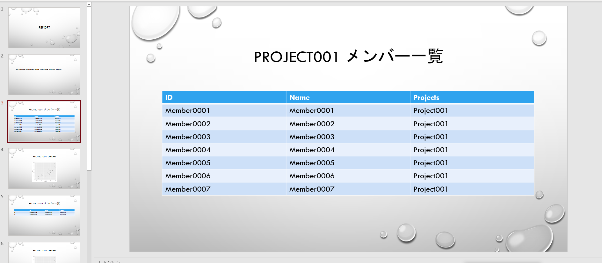

<meta property="og:image" content="./images/thumbnail.jpg">

## 概要
今年の2月ぐらいに、[Microsoft365 上のファイルを R 言語で取り扱うためのライブラリ](https://github.com/Azure/Microsoft365R) が発表された。
いままで、Sharepoint 上のファイルを R で取り扱うには、認証をくぐってファイルを取得するためのプロセスを自分で書いてやる必要があったが、晴れて公式ライブラリが発表されたので、遠慮なく使ってみる。

## エクセルからレポート作成を試してみる
データドリブンが叫ばれる世の中とはいえ、まだまだビジネスアクションの起点はエクセルファイル、アウトプットはパワポ、である場面は多いので、SharePoint に配置されたエクセルファイルを簡単なコードでレポート化できる仕組みは結構需要がある。

今回は、SharePoint 上に配置された Excel のデータファイルを読み取って、RMarkdown で パワポ 形式レポートに出力し、かつ、結果を SharePoint 上に配布するのを、自動でやってみる。


## 環境
* R 4.1.0
* Windows10

## 事前準備
特定の R Project で、 Microsoft365R をインストールする。

```R
install.packages("Microsoft365R")
```

## 動作確認
下記スクリプトを実行して、ファイルがダウンロードできることを確認する。

```R
library("Microsoft365R")
# site_url = で SharePoint Site を指定する。
site <- get_sharepoint_site(site_url = "https://XXXX.sharepoint.com/sites/SiteName/")
# Drive を取得する
drv <- get_drive()
# Drive から Path を指定して、データをダウンロードする
drv$download_file("Directory/filename.xlsx", overwrite = TRUE)

```

```get_sharepoint_site()``` を初回実行すると、URL と 認証コードが表示されるので、ブラウザーで URL を開き、認証コードを入力した後、権限の委任を実行する。
上記プロセスがうまくいき、かつ、Site へのアクセス権限があれば、ファイルがダウンロードできるようになる。

SharePoint サイトを指定するときの注意点として、 `https` から始まるサイトURL を用いてサイトを指定する場合は、 `site_url = ` を明示的に指定してやらなければいけない。 

こいつが厄介なことに、指定しない場合は、 
> 関数 "make_basic_list" を見つけることができませんでした   

という、いかにもライブラリのバージョン不整合っぽいメッセージが表示されるため、原因に気づきにくいのだが、パラメータを正確に指定すれば通るので、確認してみるといい。

## レポート作成
事前準備として、まず、Excel には下記のようなデータをあらかじめ挿入しておく。

### Projects シート

---

|ID         |Name           |
|:----------|:--------------|
|Project001 |プロジェクト１ |
|Project002 |プロジェクト２ |
|Project003 |プロジェクト３ |

### Members シート

---

|ID         |Name       |Projects   |
|:----------|:----------|:----------|
|Member0001 |Member0001 |Project001 |
|Member0002 |Member0002 |Project001 |
|Member0003 |Member0003 |Project001 |
|Member0004 |Member0004 |Project001 |
|Member0005 |Member0005 |Project001 |
|Member0006 |Member0006 |Project001 |
|Member0007 |Member0007 |Project001 |
|Member0008 |Member0008 |Project002 |
|Member0009 |Member0009 |Project002 |
|Member0010 |Member0010 |Project003 |
|Member0011 |Member0011 |Project003 |
|Member0012 |Member0012 |Project003 |
|Member0013 |Member0013 |Project003 |
|Member0014 |Member0014 |Project003 |
|Member0015 |Member0015 |Project003 |
|Member0016 |Member0016 |Project003 |
|Member0017 |Member0017 |Project003 |
|Member0018 |Member0018 |Project003 |
|Member0019 |Member0019 |Project003 |
|Member0020 |Member0020 |Project003 |

### RMarkdown
続いて、 RMarkdown を使って、レポートを作成してみる。

RMarkdown のファイル（仮に、Report.Rmd とする）を下記のようにする。

````
---
title: "ProjectManagment"
output: powerpoint_presentation
---

```{r, echo=FALSE}
library(openxlsx)
library(ggplot2)
library(knitr)
```

```{r, results='asis', echo=FALSE}
projects <- read.xlsx("downloads/ProjectManage.xlsx", sheet = "Projects")
members <- read.xlsx("downloads/ProjectManage.xlsx", sheet = "Members")
for (project in projects$ID)
{
   cat("\n\n# ", project, "メンバー一覧")
   projectMember <- members[members$Projects == project, ]
   print(kable(projectMember))
}
```
````

Report.Rmd は、 `downloads/ProjectManage.xlsx` が存在している前提で動いているので、このままだとエラーになる。かといって、上記のエクセルファイルを Git で共有してしまうと、エンジニア以外が編集するのが難しくなってしまう。

そこで、下記のような R スクリプト（仮に、BuildReport.r とする）で RMD を Wrap してあげる。

```R
# ファイルのダウンロード
library(Microsoft365R)
sp <- get_sharepoint_site(site_url = "https://XXXXXX.sharepoint.com/sites/DataSample/")
drv <- sp$get_drive()
drv$download_file("Dimensions/ProjectManage.xlsx", overwrite = TRUE, dest = "downloads/ProjectManage.xlsx")

# レポートの作成
library(rmarkdown)
render("./Report.md")

# ファイルのアップロード
drv$upload_file("./Report.pptx", dest = "Reports/ProjectManage.pptx" )

```

上記を実行すると、SharePoint からエクセルをダウンロードして、下記のようなプロジェクトごとのメンバー一覧をパワポに出力することができる。



もちろん、SharePoint 上の Excel ファイルを更新した後（例えば、プロジェクトメンバーを移動させる等）、スクリプトを再実行してやれば、多少のタイムラグはあるものの、最新のデータを反映したレポートを再出力できる。
もちろん、PowerAutomate で後続処理を書いてやれば、PJ メンバーに通知したり、再度レビューしてもらうことも可能になる。

週次でレポートを共有して報告する場合や、複数メンバーの報告事項をまとめてPPT で共有したい場合などには使えそう。

もちろん、 PowerBI のような専用のツールを使えれば、見た目の調整を容易にできたり、レポート作成環境の構築が要らなかったりと、他のメリットも享受できるため、そちらを使えるに越したことはないのだが、親会社、子会社でファイルの共有が禁止されているなど、組織のRole 整備が運用環境にマッチしないような状況では効果を発揮しそう。

社内レポートレベルであればこれで十分なうえ、まだやったことはないが、RMD の出力フォーマットを整備すれば、きれいなレポートに成型することもできる（はず）。

あまり本質的ではないものの、週次で報告作業に追われてしまっているマネージャーさんの助力になればと。

## 参考サイト
* https://qiita.com/nozma/items/c249e0d0aba028b33664